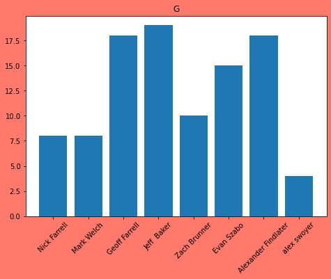
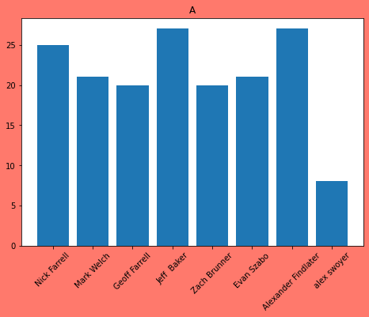
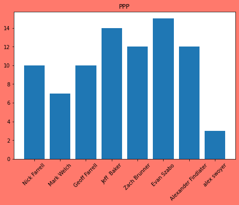
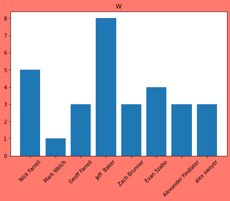
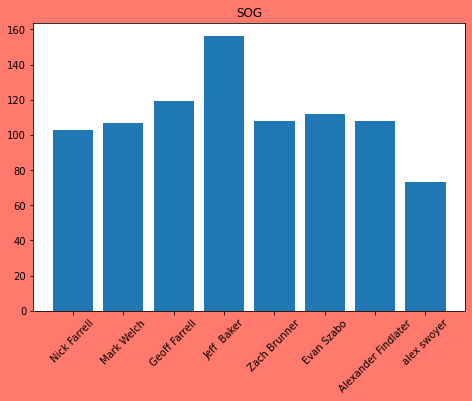

## Plot some stats by Team Owner


```python
!pip install espn_api
!pip install pandas
```

    Collecting espn_api
      Downloading espn_api-0.18.4.tar.gz (23 kB)
    Requirement already satisfied: requests<3.0.0,>=2.0.0 in /opt/conda/lib/python3.8/site-packages (from espn_api) (2.26.0)
    Requirement already satisfied: urllib3<1.27,>=1.21.1 in /opt/conda/lib/python3.8/site-packages (from requests<3.0.0,>=2.0.0->espn_api) (1.26.6)
    Requirement already satisfied: idna<4,>=2.5 in /opt/conda/lib/python3.8/site-packages (from requests<3.0.0,>=2.0.0->espn_api) (3.1)
    Requirement already satisfied: charset-normalizer~=2.0.0 in /opt/conda/lib/python3.8/site-packages (from requests<3.0.0,>=2.0.0->espn_api) (2.0.0)
    Requirement already satisfied: certifi>=2017.4.17 in /opt/conda/lib/python3.8/site-packages (from requests<3.0.0,>=2.0.0->espn_api) (2021.5.30)
    Building wheels for collected packages: espn-api
      Building wheel for espn-api (setup.py) ... [?25ldone
    [?25h  Created wheel for espn-api: filename=espn_api-0.18.4-py3-none-any.whl size=43177 sha256=1f1ed63c1850fd6346f2431172edac865a91af39f42b321282d6ef749da1954c
      Stored in directory: /root/.cache/pip/wheels/72/0f/a2/29fdea68717a62a28dde276908e1c6a2020703a67cfea48195
    Successfully built espn-api
    Installing collected packages: espn-api
    Successfully installed espn-api-0.18.4
    WARNING: Running pip as the 'root' user can result in broken permissions and conflicting behaviour with the system package manager. It is recommended to use a virtual environment instead: https://pip.pypa.io/warnings/venv
    Collecting pandas
      Downloading pandas-1.3.4-cp38-cp38-manylinux_2_17_x86_64.manylinux2014_x86_64.whl (11.5 MB)
         |████████████████████████████████| 11.5 MB 2.8 MB/s eta 0:00:01    |██████████████████▎             | 6.6 MB 2.8 MB/s eta 0:00:02     |█████████████████████▋          | 7.8 MB 2.8 MB/s eta 0:00:02
    [?25hRequirement already satisfied: numpy>=1.17.3 in /opt/conda/lib/python3.8/site-packages (from pandas) (1.21.2)
    Requirement already satisfied: python-dateutil>=2.7.3 in /opt/conda/lib/python3.8/site-packages (from pandas) (2.8.2)
    Requirement already satisfied: pytz>=2017.3 in /opt/conda/lib/python3.8/site-packages (from pandas) (2021.1)
    Requirement already satisfied: six>=1.5 in /opt/conda/lib/python3.8/site-packages (from python-dateutil>=2.7.3->pandas) (1.16.0)
    Installing collected packages: pandas
    Successfully installed pandas-1.3.4
    WARNING: Running pip as the 'root' user can result in broken permissions and conflicting behaviour with the system package manager. It is recommended to use a virtual environment instead: https://pip.pypa.io/warnings/venv


# League Stats
Pull stats from ESPN FHL API and plot shit


```python
import requests
import matplotlib.pyplot as plt
import pandas as pd
from pprint import pprint
from espn_api.hockey import League
import os
```


```python
r = requests.get("https://statsapi.web.nhl.com/api/v1/teams")

espn_s2 = "AECi2ar14IQMrzqHN4xNG8eK0d4oZIj5dzZM8AdhlVP57tyZb79LLRfT3m%2FS%2FTYmCl%2FA4T%2BJ9Rm9YOJ3a16Gm0bqhMo%2FocZgVQOL4YsWgpewsYy9Ea9HzFcoB95AFf9EL3Vbcl4AvepgJz669ibJ0hBH1NQW%2Bi0IhGhGnmMWHvgNsyhQ%2F0CWLGstmi9YbbHEM%2BlV4xXQbxMOsZYNPl57S8WJlVmuQQ5p0PpGu26mamtgHAddgwdggBqRDvEZNjXAqkdOFkLjropHaL%2Fdktw2n0o84g5YmDZQiM7nkz%2FfTJcyRg%3D%3D"

swid = "{5DE51273-9C11-445E-A3E0-9035E3D94559}"

league = League(league_id=28994, year=2022, espn_s2=espn_s2, swid=swid)
```


```python
team_stats = {team.owner: team.stats for team in league.teams}
df_stats = pd.DataFrame(team_stats).T
```


```python
for stat in ["G", "A", "PPP", "W", "SOG"]:
    fig = plt.figure()
    fig.set_facecolor('xkcd:salmon')
    ax = fig.add_axes([0,0,1,1])
    owners = list(df_stats.index)
    stats = df_stats[stat]
    ax.bar(owners, stats)
    plt.xticks(rotation=45)
    plt.title(stat)
plt.show()
```


    

    


    

    


    

    


    

    


    

    


```python

```
